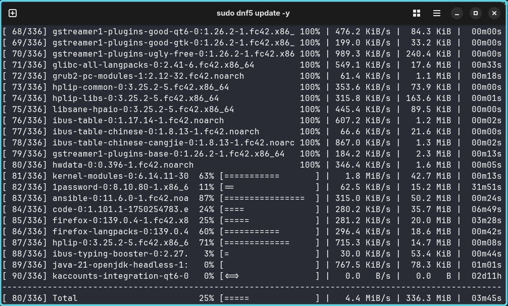

.. _Cosmic: https://system76.com/cosmic/
.. _`Ansible: https://www.ansible.com/

######################################
  Set up Fedora Linux as Workstation
######################################

************
  Preamble
************

The preamble is mostly universal for the repositories linked herein.

This is part of multiple notes about my *personal* setup of various Linux and BSD distributions. 
Some are used as desktops or servers or as virtual machines and containers. 
Each has a flavour and tweaks I will document in these lab notes.

- `Setup CentOS Linux as Server <https://github.com/TorbenJakobsen/setup_centos_linux_as_server/>`__
- `Setup Debian Linux as Server <https://github.com/TorbenJakobsen/setup_debian_linux_as_server/>`__
- `Setup Debian Linux as Workstation <https://github.com/TorbenJakobsen/setup_debian_linux_as_workstation/>`__
- `Setup Fedora Linux as Workstation <https://github.com/TorbenJakobsen/setup_fedora_linux_as_workstation/>`__
- `Setup FreeBSD as Workstationm <https://github.com/TorbenJakobsen/setup_freebsd_as_workstation/>`__
- `Setup macOS as Workstation <https://github.com/TorbenJakobsen/setup_macos_as_workstation/>`__
- `Setup Proxmox as Hypervisor <https://github.com/TorbenJakobsen/setup_proxmox_as_hypervisor/>`__

Additionally there some common components and setup.

- `Manage configuration with GNU stow <https://github.com/TorbenJakobsen/manage_configuration_with_stow/>`__ 
- `Setup Terminal and Shell <https://github.com/TorbenJakobsen/setup_terminal_and_shell/>`__ 
- `Setup Visual Studio Code <https://github.com/TorbenJakobsen/setup_visual_studio_code/>`__ 

I also have a crude utility to syncronize and 
`manage GitHub repositories <https://github.com/TorbenJakobsen/manage_github_repos/>`__
with these notes sufficeint for my personal needs.

We are all different with different knowledge and foundation,
so I appologize in advance if steps are missing or skipped.

****************
  Introduction
****************

A definite better way than manual steps
is to use Ansible_  (or similar),
and I will get there eventually.

Currently I am using Fedora 42 with Cosmic_ desktop. 

.. note::
  Cosmic_ is currently (2025-08-03) in alfa 7, but for my use performs fast and stable with only minor hiccups.

If you want to run Fedora in a container then 
Jeff Geerling's 
https://github.com/geerlingguy/docker-fedora42-ansible
is a good place to start.

Initial Housekeeping
====================

Package Manager
---------------

Use :code:`dnf5` instead of :code:`dnf` (see `dnf-vs-dnf5 <https://www.tecmint.com/dnf-vs-dnf5/>`__)
as it is a more modern and faster inplementation of :code:`dnf`.

Documentation on :code:`dnf5` commands are available `here <https://dnf5.readthedocs.io/en/latest/commands/index.html>`__.

Configure :code:`dnf` (:code:`dnf5`)
------------------------------------

Improve download speed.

.. code:: bash

  sudo nano /etc/dnf/dnf.conf

Do note that you will potentionally affect other downloads and users on the same network.

.. code:: text

  [main]

  max_parallel_downloads=10
  fastestmirror=true

This will potentionally speed up your downloads by concurrently downloading
:code:`10` instead of the default :code:`3` updates, 
but to the potential detriment of all other users on your network.

 
Initial Update
--------------

.. note:: 

  Make sure you have a network connection.

After the build of the installation media many changes will likely
have been added to your system.
So a full update is in order.

.. note::

  If you are used to :code:`apt` (Debian) and other package managers; 
  :code:`dnf5 update` and :code:`dnf5 upgrade` does the same.

.. code:: bash

  sudo dnf5 -y update

.. code:: bash

  sudo dnf5 makecache

The :code:`dnf5 makecache` command creates and downloads metadata for enabled repositories.

You can check available update packages beforehand:

.. code:: bash

  dnf5 check-update

or with identical behaviour

.. code:: bash

  dnf5 check-upgrade

Depending on your updates you should restart the system.
Strictly you could probably get away with restarting some sub-systems,
but it will likely be simpler and faster just restarting instead of 
micro-managing services and daemons.

To actually check if you nee to restart you can install the ``needs-restarting`` plugin.

.. code:: bash

  sudo dnf5 install -y dnf-utils

.. code:: bash

  dnf5 needs-restarting

See the `man <https://www.mankier.com/1/needs-restarting>`__ pages.

Third-party repositories
------------------------

Open Software Center and *optionally* add extra repositories.

EPEL (Extra Packages for Enterprise Linux) - NO
-----------------------------------------------

See https://idroot.us/install-epel-repository-fedora-42/

  A common misconception among Linux users new to Fedora is that EPEL repositories are necessary or beneficial for Fedora systems. 
  In reality, Fedora already contains virtually all packages found in EPEL — and often newer versions. 
  This situation exists because EPEL packages originate from Fedora before being adapted for Enterprise Linux distributions.

  Installing EPEL on Fedora 42 is generally unnecessary and potentially problematic. 
  Since Fedora serves as the upstream source for EPEL packages, 
  adding EPEL to Fedora creates a circular relationship that could lead to package conflicts or dependency issues. 
  Most software needs are already met through Fedora’s extensive default repositories.

https://docs.fedoraproject.org/en-US/epel/

COPR (Cool Other Package Repo) - YES
------------------------------------

See https://idroot.us/install-packages-copr-repositories-fedora/

.. code:: bash

  sudo dnf5 install dnf-plugins-core

.. code:: bash

  dnf5 copr --help

Example: COPR is used to install ghostty.

.. code:: bash

  sudo dnf5 copr enable pgdev/ghostty

RPMFusion
---------

Enable RPMFusion repositories for Fedora.

  RPM Fusion provides software that the Fedora Project or Red Hat doesn't want to ship. 
  That software is provided as precompiled RPMs for all current Fedora versions and current
  Red Hat Enterprise Linux or clones versions; 
  you can use the RPM Fusion repositories with tools like yum and PackageKit. 

  RPM Fusion is a merger of Dribble, Freshrpms, and Livna; our goal is to simplify end-user experience by grouping as much add-on software as possible in a single location. Also see our FoundingPrinciples. 

An example is Nvidia drivers.

Free

.. code:: bash

  sudo dnf5 install https://download1.rpmfusion.org/free/fedora/rpmfusion-free-release-$(rpm -E %fedora).noarch.rpm

Non-free.

.. code:: bash

  sudo dnf5 install https://download1.rpmfusion.org/nonfree/fedora/rpmfusion-nonfree-release-$(rpm -E %fedora).noarch.rpm

.. code:: bash

  sudo dnf5 upgrade --refresh

Install Firmware Updates
------------------------

| In my opinion faster and with more updates than using using Windows.
| See https://github.com/fwupd/fwupd

.. code:: bash

  sudo fwupdmgr refresh --force

.. code:: bash

  sudo fwupdmgr get-updates

.. code:: bash

  sudo fwupdmgr update

Install prefered Terminal and Shell
===================================

This topic has its own page:
https://github.com/TorbenJakobsen/setup_terminal_and_shell.

install :code:`ansible`
-----------------------

https://docs.ansible.com/ansible/latest/installation_guide/installation_distros.html

install the full package:

.. code:: bash

  sudo dnf5 install ansible

It is also possible to install just the core and modules of your choosing.

:code:`ssh` Keys
-----------------

To access :code:`git` you will need a public key.

Install :code:`gìt`
-------------------

.. code:: bash

  sudo dnf5 install git

Follow: https://docs.github.com/en/authentication/connecting-to-github-with-ssh/generating-a-new-ssh-key-and-adding-it-to-the-ssh-agent

.. code:: bash

  git config --global user.email "TorbenJakobsen@users.noreply.github.com"
  git config --global user.name "Torben Jakobsen"
  git config --global init.defaultBranch "main"

Of course you should use **your** name and and email address.

*Depending on your preferences*. 
Personally I like :code:`code` to open. 
You may prefer :code:`vi`, :code:`vim`, :code:`neovim`, or the default.

.. code:: bash

  git config --global core.editor "code --wait"

Recommended: Optionally install public key in GitHub
~~~~~~~~~~~~~~~~~~~~~~~~~~~~~~~~~~~~~~~~~~~~~~~~~~~~

I use GitHub and other services and have other servers that I want to access.

To install public key in GitHub follow the
`docs <https://docs.github.com/en/authentication/connecting-to-github-with-ssh/adding-a-new-ssh-key-to-your-github-account?tool=webuing-a-new-ssh-key-to-your-github-account?tool=webui>`__.

Install Visual Studio Code
--------------------------

Follow the official  
`documentation <https://code.visualstudio.com/docs/setup/linux#_rhel-fedora-and-centos-based-distributions>`__.

.. code:: bash 

  sudo rpm --import https://packages.microsoft.com/keys/microsoft.asc

.. code:: bash 

  echo -e "[code]\nname=Visual Studio Code\nbaseurl=https://packages.microsoft.com/yumrepos/vscode\nenabled=1\nautorefresh=1\ntype=rpm-md\ngpgcheck=1\ngpgkey=https://packages.microsoft.com/keys/microsoft.asc" | sudo tee /etc/yum.repos.d/vscode.repo > /dev/null

Now install :code:`code`:

.. code:: bash 

  sudo dnf5 makecache

.. code:: bash 

  sudo dnf5 check-update

.. code:: bash 

  sudo dnf5 install code

The official guide is
`here <https://code.visualstudio.com/docs/setup/linux>`__.

Finalize installation by following 
`Setup Visual Studio Code <https://github.com/TorbenJakobsen/setup_visual_studio_code/>`__.

Install Docker
--------------

Follow:
https://docs.docker.com/engine/install/fedora/

The general installation:
https://docs.docker.com/engine/install/

A CLI alternative to Docker Desktop is :code:`lazydocker`.

.. note::

  To have docker running you need the engine running...

Install :code:`podman`  
----------------------

Install and configure default shell and Terminal
------------------------------------------------

See
<https://github.com/TorbenJakobsen/setup_terminal_and_shell>
for how to configure :code:`zsh` as default shell and more.

Other packages to consider
--------------------------

* draw.io
* tldr (tealdeer)

.. code:: bash 

  sudo dnf5 install tealdeer

duf

.. code:: bash 

  sudo dnf5 install duf

https://github.com/Canop/dysk

dysk

https://ostechnix.com/get-linux-filesystems-information-using-dysk/

install rust

https://ostechnix.com/install-rust-programming-language-in-linux/

zig

FUSE

  https://github.com/appimage/appimagekit/wiki/fuse

gcc + c linker

.. code:: bash 

  sudo dnf5 gcc

Boot Manager
============

.. code:: bash
  
  grub2-mkconfig -o /boot/grub2/grub.cfg
